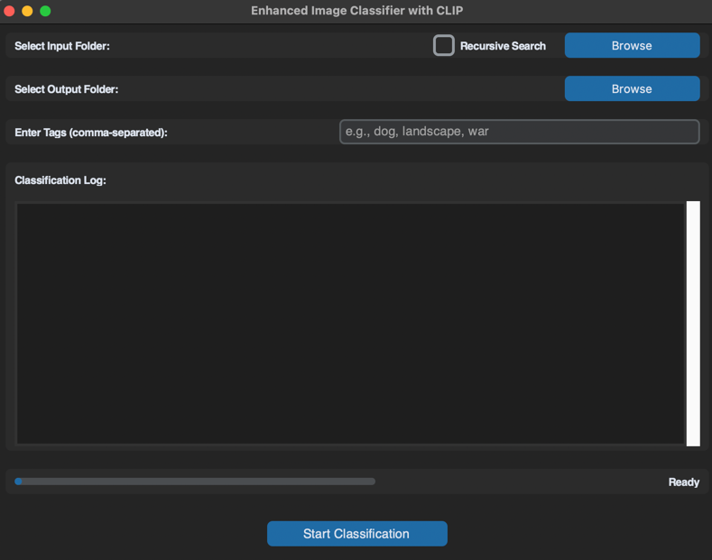

# OrganAIze - Image Classifier


This project is an image classification tool that utilizes OpenAI's CLIP model to categorize images based on user-defined tags. The application features a graphical interface built with `customtkinter`, providing an intuitive experience for selecting folders, managing classification parameters, and viewing classification progress.

## Features

- **Recursive Image Search**: Optionally search for images within all subdirectories.
- **User-Defined Tags**: Enter custom tags to categorize images.
- **Progress Tracking**: Visual progress bar that updates as each image is classified.
- **Categorized Output**: Classified images are saved in folders named after their predicted tags.
- **Error Handling and Logging**: Logs each processed image with the probabilities for each tag and reports any errors.

## Prerequisites

- **Python 3.7+**
- **Dependencies**:
  - `transformers`
  - `torch`
  - `requests`
  - `pillow`
  - `customtkinter`

Install dependencies using:
```bash
pip install -r requirements.txt
```

## Installation

1. Clone the repository:    
    ```bash
   git clone https://github.com/yourusername/EnhancedImageClassifier.git
    ```
2. Navigate to the project directory:
   ```bash
   cd EnhancedImageClassifier
    ```

3. Install dependencies:
   ```bash
   pip install -r requirements.txt
    ```

   
## Usage


1. Run the application:
   ```bash
   python main.py
    ```

2. In the GUI:
   - **Select Input Folder**: Choose the folder containing images to classify.
   - **Select Output Folder**: Choose where classified images should be saved.
   - **Enter Tags**: Specify comma-separated tags to categorize the images.
   - **Recursive Search**: Check this option if you want to search for images in subdirectories.
   - **Start Classification**: Click to begin. A progress bar will track the progress, and logs will display results.

3. After classification, each image will be saved in a folder within the output directory, named after the most likely tag.

## Project Structure

- **main.py**: Entry point that starts the GUI.
- **gui.py**: Contains the `ImageClassifierApp` class, which defines the graphical interface and its logic.
- **classifier.py**: Defines the `classify_images_with_tags` function to process images based on tags and organize the output.
- **utils.py**: Loads the CLIP model and processor.
- **requirements.txt**: List of required packages.

## Example

1. **Input Folder**: A folder containing images to classify.
2. **Output Folder**: A directory where classified images will be saved in folders named by their predicted tags.
3. **Tags**: e.g., "dog, cat, landscape" will classify images into these categories.

## Troubleshooting

- **No images found**: Ensure the input folder contains images with extensions `.png`, `.jpg`, or `.jpeg`.
- **Progress Bar Not Updating**: Verify that `total_images` is calculated correctly and the progress bar is updated within each iteration in `classify_images_with_tags`.
- **Model Loading Issues**: Check your internet connection, as the CLIP model will download if not previously cached.
